<div align="center">

# aSDMs :: aquatic Species Distribution Models

</div>


# Repository Overview

This repository contains the complete set of analysis scripts, and final outputs (rasters and figures) from our study. Additionally, we begin with a user-friendly tutorial - a conceptual exercise that demonstrates our methodology step-by-step, making it accessible for readers to replicate and explore. The input files are included in this repository either as raw data either stored in public repositories with a link included due large sizes. The six sequential scripts are provided in the form of transferable R files.

# Project structure
```
├── 📁 data/          # 🌡️ Local data (bioclimatic vars, hydrological layers)
├── 📁 supplementary/ # 📑 Output - Supplementary Figures
├── 📁 Scripts        # 💻 Main analysis scripts (see structure below)
├── 📁 outputs/       # 🖨️ Generated figures & analysis results
└── 📁 figures/       # 🖼️ Final manuscript figures
```
# 🔗 Data
The baseline layers 🌐 required for the analysis can be downloaded from here: https://saco.csic.es/s/SYTM8qZrnY2HG5q

# 📚 Supplementary material
All the information related to the Supplementary material of this study can be accessed by the following link: https://saco.csic.es/s/3p7n9p724kYr5jN

# 💻 Fundamental Scripts
The structure of the scripts for the primary analysis set is structured as: 
```
├── 🌍Post_Alien/       # i) Widespread species - Global aSDMs "Post_Global_Alien" and ii) Widespread species - Global to Regional aSDMs "Post_Regional_Alien"
├── 🏝️Post_Endemics/    # i) Endemic species - Regional aSDMs "Post_Regional_Endemics" 
├── 🌍Pre_Alien/        # i) Widespread species - Global aSDMs "Pre_Global_Alien" and ii) Widespread species - Global to Regional aSDMs "Pre_Regional_Alien"
└── 🏝️Pre_Endemics/     # i) Endemic species - Regional aSDMs "Pre_Regional_Endemics"

Key: 🌍 = Global scale | 🏝️ = Regional/Endemic focus  
```

# 📈 Outputs
The repository represents a stand-alone analysis package and contains the full set of initial data and the required script to generate the figures of the study:
```
📁 outputs/
├── 📁 input/                 # 🗺️ Stacked suitability maps
├── 📁 metrics_vagenas_et_al/ # 📈 Model performance metrics
└── 📁 Script_Metanalysis/    # 🔄 Stand-alone analysis script
```
---

# 🌊aSDM Demo: Predicting Habitat Suitability in Aquatic Ecosystems🌊
📋 Description

You are an aquatic ecologist/ecohydrological engineer and you want to predict the distribution of multiple endemic species in a hydrographic network. Your task is to build an aquatic Species Distribution Model (aSDM) that predicts suitability scores or species richness based on:

<div align="center">
  
<table>
  <tr>
    <th>Model Architecture</th>
    <th>Symbol</th>
    <th>Key Variables</th>
    <th>Short ID</th>
  </tr>
  <tr>
    <td>Climate aSDM</td>
    <td>🌡️</td>
    <td>Temperature, Precipitation</td>
    <td><code>clima_SDM</code></td>
  </tr>
  <tr>
    <td>Hydrological aSDM</td>
    <td>💧</td>
    <td>Discharge, Stream gradient</td>
    <td><code>hydro_aSDM</code></td>
  </tr>
  <tr>
    <td>Hydroclimatic aSDM</td>
    <td>🌡️ & 💧</td>
    <td>Climate × Hydrological</td>
    <td><code>hydroclima_aSDM</code></td>
  </tr>
  <tr>
    <td>Hierarchical Climate</td>
    <td>🌡️→💧</td>
    <td>Climate + Hydro covariate</td>
    <td><code>h_clima_aSDM</code></td>
  </tr>
  <tr>
    <td>Hierarchical Hydro</td>
    <td>💧→🌡️</td>
    <td>Hydro + Climate covariate</td>
    <td><code>h_hydro_aSDM</code></td>
  </tr>
</table>

</div>


```mermaid
%%{init: {'theme': 'base', 'themeVariables': {
    'fontFamily': 'Arial',
    'primaryColor': '#333',
    'primaryBorderColor': '#fff',
    'primaryTextColor': '#fff',
    'lineColor': '#fff',
    'arrowheadColor': '#fff',
    'textColor': '#fff'
}}}%%
flowchart TD
    A(("<b>📊<br/>Aquatic SDM<br/>Predictors</b>")):::centerNode
    B("<b>🌡️<br/>clima_aSDM</b>"):::outerNode
    C("<b>💧<br/>hydro_aSDM</b>"):::outerNode
    D("<b>🌡️💧<br/>hydroclima_aSDM</b>"):::outerNode
    E("<b>🌡️→💧<br/>h_clima_aSDM</b>"):::outerNode
    F("<b>💧→🌡️<br/>h_hydro_aSDM</b>"):::outerNode

    A --o B
    A --o C
    A --o D
    A --o E
    A --o F
    B --o F
    C --o E

    classDef centerNode stroke:#fff,stroke-width:3px,fill:#333
    classDef outerNode stroke:#fff,stroke-width:2px,fill:#444
    
    linkStyle default stroke:#fff,stroke-width:2px
    linkStyle 5,6 stroke:#fff,stroke-width:3px

```

### Start of Tutorial
# aSDMs :: Aquatic Species Distribution Models - Tutorial

This tutorial demonstrates a workflow for building aquatic Species Distribution Models (aSDMs) using occurrence data and environmental predictors. In this exercise, we provide a computational-light exercise with seven random species that demonstrates our methodology step-by-step, by implementing the pre-constrained h5 climate aSDMs, thus making it accessible for readers to replicate and explore. To download the repository which includes all the required files for the demo execution download from: https://saco.csic.es/s/Co8WNBa323ft3Qi.

## Step 0 :: Required Packages
```r
# List of required packages
pkgs <- c("sf", "sdm", "dismo", "dplyr", "tidyr", 
          "mapview", "geodata", "raster", "RColorBrewer",
          "terra", "usdm", "randomForest", "parallel")

# Install missing packages in one command
if (length(setdiff(pkgs, rownames(installed.packages()))) > 0) {
  install.packages(setdiff(pkgs, rownames(installed.packages())))
}

# Load all packages silently
invisible(lapply(pkgs, library, character.only = TRUE))
```

## Step 1 :: Data Input
```r
setwd("C:/XXX/XXX/")
data_sp<-vect("random_species_subset_sp10.shp")
terra_df <- data_sp  # Full occurrence dataset
unique_species <- unique(terra_df$species_id)
numbers_sp <- length(unique_species)
numbers_sp
```

## Step 2 :: Hydroclimatic Predictors
```r
riveratl_global <- rast("top5_global_rivers_atlas_raster_list_30sec.tif")
bioclim_global_rn <- rast("bioclim_global_rn_5vars_30sec.tif")
```

## Step 3 :: Initialize SDM Structures
```r
results_df <- data.frame(
  id = integer(),
  species_name = integer(),
  e_AUC = numeric(),
  e_COR = numeric(),
  t_maxSSS = numeric(),
  t_maxkappa = numeric(),
  t_prevalence = numeric(),
  CBI = numeric(),
  maxKappa = numeric(),
  maxTSS = numeric(),
  obs_prevalence = numeric(),
  stringsAsFactors = FALSE
)

raster_list <- list()
combined_rasters <- rast()
sdm_d <- list()
```

## Step 4 :: Spatial Processing - Allocation to watersheds
```r
watershed <- vect("H5_Iberian/H5_Iberian.shp") #the user should define the spatial layer, in our files the H8 and H12 alternatives are available

# CRS Handling and Conversion
if (is.factor(terra_df$species_id)) {
  terra_df$species_id <- as.numeric(levels(terra_df$species_id))[terra_df$species_id]
} else {
  terra_df$species_id <- as.numeric(terra_df$species_id)
}
crs(terra_df) <- "EPSG:4326"
miteco_sp_vect <- terra_df

# Intersect occurrences with watersheds
miteco_sp_in <- terra::intersect(miteco_sp_vect, watershed)

# Data Conversion Pipeline
data <- as.data.frame(miteco_sp_in)
data$geometry <- NULL
coords <- geom(miteco_sp_in)
terra_df_o <- cbind(coords, data)

# Species Filtering (≥10 obs)
terra_df_or <- terra_df_o %>%
  mutate(species_id = as.numeric(factor(terra_df_o$species_id)))

species_name_id <- dplyr::select(terra_df_or, "species_id", "HYBAS_ID")

terra_df_filtered <- terra_df_or %>%
  group_by(species_id) %>%
  filter(n() >= 10) %>%
  ungroup() %>%
  droplevels()


# First, convert your spatial vector data to a dataframe
terra_df_conv <- as.data.frame(terra_df_filtered)

# Now create the presence-absence matrix
presence_absence_matrix <- terra_df_conv %>%
  mutate(presence = 1) %>%
  dplyr::select(species_id, HYBAS_ID, presence) %>%
  distinct() %>%
  pivot_wider(names_from = HYBAS_ID, values_from = presence, values_fill = list(presence = 0)) %>%
  as.data.frame()

# Order ascendingly by species_id
presence_absence_matrix <- presence_absence_matrix[order(presence_absence_matrix$species_id),]

# Convert presence-absence table back to long format
presence_long <- presence_absence_matrix %>%
  pivot_longer(-species_id, names_to = "HYBAS_ID", values_to = "presence")


# Spatial Template Preparation
iberian_watersheds <- watershed
aggregated_vec <- aggregate(iberian_watersheds)
resolution <- res(bioclim_global_rn)
raster_template <- rast(ext(aggregated_vec), resolution = resolution)
aggregated_raster <- rasterize(aggregated_vec, raster_template, field = 1, fun = "count")
aggregated_raster[!is.na(aggregated_raster)] <- NA
crs(aggregated_raster) <- "EPSG:4326"


combined_rasters<-resample(combined_rasters,aggregated_raster)
crs(combined_rasters)<- "EPSG:4326"

```
## Step 5 :: aSDM Models Prediction - Fitting
```r
input_cov <- bioclim_global_rn  # Primary covariates climate aSDM - in case the user wants to apply hydrological or hydroclimatic or hierarchical approaches the fundamental documentation should be followed

# Initialize lists
polygon_list <- list()
raster_list <- list()
sdm_d <- list()
combined_rasters_stack <- rast()
results_df <- data.frame()

# Define the vector of numbers
numbers_sp <- levels(as.factor(terra_df$species_id))


for (i in 1:length(numbers_sp)) {
  
  #set covariates
  input_cov <- bioclim_global_rn  # Use your primary covariates
  
  # Get presence data for the current species
  species_data <- presence_long %>%
    filter(species_id == unique(presence_long$species_id)[[i]] & presence == 1)
  
  # Get the watershed IDs
  watershed_id <- species_data$HYBAS_ID
  
  # Get the corresponding freshwater polygon for this HYBAS_ID
  masked_watershed <- watershed[watershed$HYBAS_ID %in% watershed_id, ]
  
  # Connect the watersheds produced in a single polygon
  polygon_list[[i]] <- masked_watershed
  
  # Dissolve the different watersheds to function as the training region
  dissolve <- aggregate(polygon_list[[i]], dissolve = TRUE)
  
  # Combine the raster objects
  combined_raster <- c(input_cov)
  
  ############ RUN THE SDMs #############
  
  bioc_gal_in <- combined_raster
  
  crs(dissolve) <- "EPSG:4326"
  
  # Crop the bioclim to the extent of the watersheds where the species belongs to
  bioc_gal_in_crop <- crop(bioc_gal_in, dissolve, mask = TRUE)
  
  # Pre-set the dataset - CORRECTED: use single brackets [i]
  terra_df_demo <- terra_df[terra_df$species_id == numbers_sp[i], ]
  terra_df_demo$species_id[terra_df_demo$species_id == numbers_sp[i]] <- 1
  
  # Convert SpatVector to data frame with coordinates
  terra_df_demo_df <- as.data.frame(terra_df_demo, geom = "XY")
  
  # Create SpatialPointsDataFrame from coordinates
  terra_df_demo_f <- SpatialPointsDataFrame(
    coords = terra_df_demo_df[, c("x", "y")],
    data = data.frame(species_id = rep(1, nrow(terra_df_demo_df))),
    proj4string = CRS("+init=EPSG:4326")
  )
  
  # Generate background points equal to 5% of the training area
  background_points <- sum(freq(bioc_gal_in_crop[[1]]))* 0.05
  
  # Convert SpatRaster to RasterBrick
  r_bioc_gal_in_crop <- as(bioc_gal_in_crop, "Raster")
  
  d <- sdmData(species_id ~ ., terra_df_demo_f, predictors = r_bioc_gal_in_crop, 
               bg = list(method = 'gRandom', n = round(background_points), exclude = TRUE))
  
  # Store the background points in a vector to be evaluated at a later stage
  sdm_d[[i]] <- d
  
  # SDM function to fit the models
  m <- sdm(species_id ~ ., d, methods = c('glm', 'brt', 'rf'), replication = c('boot'),
           test.p = 30, n = 2, parallelSetting = list(ncore = 4, method = 'parallel'))
  
  # Current prediction to the rest of the 30%
  p2 <- predict(m, r_bioc_gal_in_crop)
  
  en1 <- ensemble(m, p2, setting = list(method = 'weighted', stat = 'auc'))
  e <- evaluates(d, en1)
  bc <- sdm:::.boyce(e@observed, e@predicted)
  
  results_df <- rbind(results_df, data.frame(
    id = i,
    species_id = paste("Species", i),
    e_AUC = e@statistics$AUC,
    e_COR = e@statistics$COR[1],
    CBI = bc$CBI,
    maxTSS = e@threshold_based$TSS[2],
    maxKappa = e@threshold_based$Kappa[5],
    t_maxSSS = e@threshold_based$threshold[2],
    t_maxkappa = e@threshold_based$threshold[5],
    t_prevalence = e@threshold_based$threshold[10],
    obs_prevalence = length(d@species$species_id@presence) / 
      (length(d@species$species_id@background) + length(d@species$species_id@presence))
  ))
  
  
  #name the raster file based on the species name
  species_name <- terra_df$Species[terra_df$species_id == i][1]
  names(en1) <- species_name
  
  #Combine the aSDM into the Iberian extent
  crop_en1<-mask(en1,aggregated_vec)
 
  mask_en1<- resample(crop_en1, combined_rasters, method = "near")
  #plot(mask_en1)
  
  # Reproject raster1 to the CRS of raster2
  crs(mask_en1) = "EPSG:4326"
  
  #store all the species in a combon raster file
  combined_rasters_stack <- c(combined_rasters_stack,mask_en1)
  
  # Define the file name for saving and NAME IT BASE ON THE SPECIES ACCORDING TO THE INTIAL LEDGER
  file_name <- paste0("deleteplease.tif")
  
  # Save the raster file
  writeRaster(en1, filename = file_name, overwrite = TRUE)
  
  # Print a message indicating the file has been saved
  cat("Saved:", file_name, "for iteration:", i, "\n")
}

# Assess the number of layers and the generated habitat suitability raster layer
nlyr(combined_rasters_stack)

plot(combined_rasters_stack)

```

## Step 6 :: Post-Processing - Thresholding based on prevalence
```r
# Threshold Application
thresholded_rasters_list <- list()

for (i in 1:max(results_df$id)) {
  threshold_value <- results_df$obs_prevalence[i]
  thresholded_raster <- app(
    combined_rasters_stack[[i]], 
    fun = function(x) ifelse(x > threshold_value, 1, 0)
  )
  thresholded_rasters_list[[i]] <- thresholded_raster
}

# Combine all at once
thresholded_rasters_comb <- rast(thresholded_rasters_list)
names(thresholded_rasters_comb) <- results_df$species_id[1:length(thresholded_rasters_list)]

# Species Richness Calculation
masked_rasters <- lapply(thresholded_rasters_comb, function(r) {
  r[is.na(r)] <- 0
  return(r)
})
stacked_raster <- rast(masked_rasters)
final_stack <- sum(stacked_raster)

#Plot species richness based on thresholded prevalence per species
plot(stacked_raster)

#Plot species richness based on thresholded prevalence for all species summed
plot(final_stack)

# Final Outputs
writeRaster(combined_rasters_stack, "preh5_clima_endemics_1km.tif", overwrite = TRUE)
writeRaster(final_stack,"species_richness_thresholded_1km.tif",overwrite=TRUE)
write.csv(results_df, "preh5_clima_endemics_metrics.csv", row.names = FALSE)
```
### End of Tutorial

# Manuscript Outline

## Abstract:
Aim: Species Distribution Models (SDMs) have traditionally been developed in a terrestrial context, and their application to aquatic ecosystems presents unique challenges. These include predicting species distributions across spatially constrained environments, and incorporating specific environmental drivers such as hydromorphological features. We address these challenges by exploring various spatially-explicit model training strategies, novel hierarchical model structures and different flexible predictor sets. Our goal is to establish a framework for modelling aquatic species distributions that accounts for the distinct biogeography of freshwater systems.

Innovation: We demonstrate the application of a novel analytical framework to model aquatic species distributions by investigating three critical dimensions: (i) the optimal spatial training extent for SDMs in freshwater ecosystems; (ii) the effect of multiple predictor combinations—from single variables to hierarchical sets integrating climatic, hydrological, and interactive factors—on predictive performance; and (iii) the interplay between climate and hydrology in predicting species distributions from global to regional scales. This systematic cross-comparison forms the core of our methodological framework for assessing the predictive capacity across all model configurations.

Main conclusions: We used the Iberian freshwater fish as a case study. Our results show that pre-constrained models to a species' watershed of occurrence—meaning they are trained within its boundaries—deliver higher predictive accuracy, effectively validating a spatially-constrained modelling strategy as the best practice. Furthermore, our results demonstrate that climate-based predictors consistently outperform purely hydrological ones, a finding with broad relevance for understanding freshwater species' sensitivity to large-scale environmental change. Our framework provides a basis for standardising SDMs in freshwater systems, with the rigorous protocol established serving as a foundational model for global applications.

### Keywords: 
SDMs, freshwaters, fish, hydrology, climate, watersheds, hierarchical, aquatic species

#### Citation (APA):
Vagenas, G., Matias, M., Araujo M.B. (2025). Beyond land: a framework for modelling aquatic species distributions. (Submitted)
 
#### DOI:  
[Pending]

# Figures


**Figure 1**. Spatial distribution of species richness of the dataset used for the development of the aSDMs through a (A) global (50 arc-minute grid) to (B) regional (10 arc-minute grid) approach for the 98 freshwater fish species of the study area. Colors represent gradients of species richness (low = yellow; high = red). The finer resolution map (B) highlights richness patterns in the Iberian Peninsula.


**Figure 2.** Flowchart illustrating the implementation and evaluation workflow for aquatic Species Distribution Models (aSDMs), comprising nine sequential stages (i.e., I-IX), from input data preparation and modelling through to performance evaluation and the generation of stacked suitability maps.


**Figure 3.** Variable performarnce across different training extents and predictor settings for the freshwater fish species of the Iberian peninsula.


**Figure 4.** Stacked ensembled aSDMs for the freshwater fish species of the Iberian Peninsula. The maps represent stacked outputs derived through aSDMs using the pre-constrained h5 spatial strategy, by ensembling all the three predictor sets (i.e., climate, hydroclimatic, hydromorphology). The bottom distance-suitability trajectory chart indicates the variation of predicted suitability values across a vertical transect of the study area, indicating the baseline patterns for the thermal (orange), the hydrological (blue) and the locally influenced (green) niche for the freshwater species.

# Author: Georgios Vagenas

Name: PhD Researcher - Georgios Vagenas (georgios.vagenas@mncn.csic.es | georgvagenas@gmail.com)

Affiliation: Biogeography and Global Change Department, National Museum of Natural Sciences, CSIC, C/ Jose Gutierrez Abascal, 2, Madrid 28006, Spain

**Last modified: 15/6/2026**


