<div align="center">

# aSDMs :: aquatic Species Distribution Models

</div>

# Repository Overview

This repository contains the complete set of baseline input data, analysis scripts, and final outputs (rasters and figures) from our study. Additionally, we begin with a user-friendly "Toy Problem" tutorial - a lightweight, computational exercise that demonstrates our methodology step-by-step, making it accessible for readers to replicate and explore.


# Project structure
```
├── 📁 data/          # 🌡️ Local data (bioclimatic vars, hydrological layers)
├── 📁 supplementary/ # 📑 Output - Supplementary Figures
├── 📁 Scripts        # 💻 Main analysis scripts (see structure below)
├── 📁 outputs/       # 🖨️ Generated figures & analysis results
└── 📁 figures/       # 🖼️ Final manuscript figures
```
# 🔗 Data
The baseline layers 🌐 required for the analysis can be downloaded from here: https://saco.csic.es/s/SYTM8qZrnY2HG5q

# 📚 Supplementary material
All the information related to the Supplementary material of this study can be accessed by the following link: https://saco.csic.es/s/3p7n9p724kYr5jN

# 💻 Fundamental Scripts
The structure of the scripts for the primary analysis set is structured as: 
```
├── 🌍Post_Alien/       # i) Widespread species - Global aSDMs "Post_Global_Alien" and ii) Widespread species - Global to Regional aSDMs "Post_Regional_Alien"
├── 🏝️Post_Endemics/    # i) Endemic species - Regional aSDMs "Post_Regional_Endemics" 
├── 🌍Pre_Alien/        # i) Widespread species - Global aSDMs "Pre_Global_Alien" and ii) Widespread species - Global to Regional aSDMs "Pre_Regional_Alien"
└── 🏝️Pre_Endemics/     # i) Endemic species - Regional aSDMs "Pre_Regional_Endemics"

Key: 🌍 = Global scale | 🏝️ = Regional/Endemic focus  
```

# 📈 Outputs
The repository represents a stand-alone analysis package and contains the full set of initial data and the required script to generate the figures of the study:
```
📁 outputs/
├── 📁 input/                 # 🗺️ Stacked suitability maps
├── 📁 metrics_vagenas_et_al/ # 📈 Model performance metrics
└── 📁 Script_Metanalysis/    # 🔄 Stand-alone analysis script
```
---

# 🌊 **Toy Problem: Predicting Habitat Suitability in Aquatic Ecosystems** 🌊
📋 Description

You are an aquatic ecologist/ecohydrological engineer and you want to predict the distribution of multiple endemic species in a hydrographic network. Your task is to build an aquatic Species Distribution Model (aSDM) that predicts suitability scores or species richness based on:

<div align="center">
  
<table>
  <tr>
    <th>Model Architecture</th>
    <th>Symbol</th>
    <th>Key Variables</th>
    <th>Short ID</th>
  </tr>
  <tr>
    <td>Climate aSDM</td>
    <td>🌡️</td>
    <td>Temperature, Precipitation</td>
    <td><code>clima_SDM</code></td>
  </tr>
  <tr>
    <td>Hydrological aSDM</td>
    <td>💧</td>
    <td>Discharge, Stream gradient</td>
    <td><code>hydro_aSDM</code></td>
  </tr>
  <tr>
    <td>Hydroclimatic aSDM</td>
    <td>🌡️ & 💧</td>
    <td>Climate × Hydrological</td>
    <td><code>hydroclima_aSDM</code></td>
  </tr>
  <tr>
    <td>Hierarchical Climate</td>
    <td>🌡️→💧</td>
    <td>Climate + Hydro covariate</td>
    <td><code>h_clima_aSDM</code></td>
  </tr>
  <tr>
    <td>Hierarchical Hydro</td>
    <td>💧→🌡️</td>
    <td>Hydro + Climate covariate</td>
    <td><code>h_hydro_aSDM</code></td>
  </tr>
</table>

</div>


```mermaid
%%{init: {'theme': 'base', 'themeVariables': {
    'fontFamily': 'Arial',
    'primaryColor': '#333',
    'primaryBorderColor': '#fff',
    'primaryTextColor': '#fff',
    'lineColor': '#fff',
    'arrowheadColor': '#fff',
    'textColor': '#fff'
}}}%%
flowchart TD
    A(("<b>📊<br/>Aquatic SDM<br/>Predictors</b>")):::centerNode
    B("<b>🌡️<br/>clima_aSDM</b>"):::outerNode
    C("<b>💧<br/>hydro_aSDM</b>"):::outerNode
    D("<b>🌡️💧<br/>hydroclima_aSDM</b>"):::outerNode
    E("<b>🌡️→💧<br/>h_clima_aSDM</b>"):::outerNode
    F("<b>💧→🌡️<br/>h_hydro_aSDM</b>"):::outerNode

    A --o B
    A --o C
    A --o D
    A --o E
    A --o F
    B --o F
    C --o E

    classDef centerNode stroke:#fff,stroke-width:3px,fill:#333
    classDef outerNode stroke:#fff,stroke-width:2px,fill:#444
    
    linkStyle default stroke:#fff,stroke-width:2px
    linkStyle 5,6 stroke:#fff,stroke-width:3px

```

### Start of Tutorial
# aSDMs :: Aquatic Species Distribution Models - Tutorial

This tutorial demonstrates a workflow for building aquatic Species Distribution Models (aSDMs) using occurrence data and environmental predictors. In this exercise, we provide a computational-light exercise with seven random species that demonstrates our methodology step-by-step, by implementing the pre-constrained h5 climate aSDMs, thus making it accessible for readers to replicate and explore. To download the repository which includes all the required files for the toy problem execution download from: https://saco.csic.es/s/Co8WNBa323ft3Qi.

## Step 0 :: Required Packages
```r
# List of required packages
pkgs <- c("sf", "sdm", "dismo", "dplyr", "tidyr", 
          "mapview", "geodata", "raster", "RColorBrewer",
          "terra", "usdm", "randomForest", "parallel")

# Install missing packages in one command
if (length(setdiff(pkgs, rownames(installed.packages()))) > 0) {
  install.packages(setdiff(pkgs, rownames(installed.packages())))
}

# Load all packages silently
invisible(lapply(pkgs, library, character.only = TRUE))
```

## Step 1 :: Data Input
```r
setwd("C:/XXX/XXX/XXX/aSDM_toy_problem/")
data_sp<-vect("sevensp_toyprob.shp")
terra_df <- data_sp  # Full occurrence dataset
unique_species <- unique(terra_df$species_id)
numbers_sp <- length(unique_species)
```

## Step 2 :: Hydroclimatic Predictors
```r
riveratl_global <- rast("data/River_atlas_1km_5vars/top5_global_rivers_atlas_raster_list_30sec.tif")
bioclim_global_rn <- rast("data/BIOCLIM_rn_1km_5vars/bioclim_global_rn_5vars_30sec.tif")
```

## Step 3 :: Initialize SDM Structures
```r
results_df <- data.frame(
  id = integer(),
  species_name = integer(),
  e_AUC = numeric(),
  e_COR = numeric(),
  t_maxSSS = numeric(),
  t_maxkappa = numeric(),
  t_prevalence = numeric(),
  CBI = numeric(),
  maxKappa = numeric(),
  maxTSS = numeric(),
  obs_prevalence = numeric(),
  stringsAsFactors = FALSE
)

raster_list <- list()
combined_rasters <- rast()
sdm_d <- list()
```

## Step 4 :: Spatial Processing - Allocation to watersheds
```r
watershed <- vect("data/H5_Iberian/H5_Iberian.shp") #the user should define the spatial layer, in our files the H8 and H12 alternatives are available

# CRS Handling and Conversion
if (is.factor(terra_df$species_id)) {
  terra_df$species_id <- as.numeric(levels(terra_df$species_id))[terra_df$species_id]
} else {
  terra_df$species_id <- as.numeric(terra_df$species_id)
}
crs(terra_df) <- "EPSG:4326"
miteco_sp_vect <- terra_df

# Intersect occurrences with watersheds
miteco_sp_in <- terra::intersect(miteco_sp_vect, watershed)

# Data Conversion Pipeline
data <- as.data.frame(miteco_sp_in)
data$geometry <- NULL
coords <- geom(miteco_sp_in)
terra_df_o <- cbind(coords, data)

# Species Filtering (≥10 obs)
terra_df_or <- terra_df_o %>%
  mutate(species_id = as.numeric(factor(terra_df_o$species_id)))

species_name_id <- dplyr::select(terra_df_or, "species_id", "HYBAS_ID")

terra_df_filtered <- terra_df_or %>%
  group_by(species_id) %>%
  filter(n() >= 10) %>%
  ungroup() %>%
  droplevels()

# Presence-Absence Matrix Construction
presence_absence_matrix <- terra_df_conv %>%
  mutate(presence = 1) %>%
  dplyr::select(species_id, HYBAS_ID, presence) %>%
  distinct() %>%
  pivot_wider(names_from = HYBAS_ID, values_from = presence, values_fill = list(presence = 0)) %>%
  as.data.frame() %>%
  .[order(.$species_id),]

presence_long <- presence_absence_matrix %>%
  pivot_longer(-species_id, names_to = "HYBAS_ID", values_to = "presence")

# Spatial Template Preparation
iberian_watersheds <- watershed
aggregated_vec <- aggregate(iberian_watersheds)
resolution <- res(bioclim_global_rn)
raster_template <- rast(ext(aggregated_vec), resolution = resolution)
aggregated_raster <- rasterize(aggregated_vec, raster_template, field = 1, fun = "count")
aggregated_raster[!is.na(aggregated_raster)] <- NA
crs(aggregated_raster) <- "EPSG:4326"
```
## Step 5 :: aSDM Models Prediction - Fitting
```r
input_cov <- bioclim_global_rn  # Primary covariates climate aSDM - in case the user wants to apply hydrological or hydroclimatic or hierarchical approaches the fundamental documentation should be followed

for (i in 1:numbers_sp) {
  # Watershed Processing
  species_data <- presence_long %>%
    filter(species_id == unique(presence_long$species_id)[[i]] & presence == 1)
  
  watershed_id <- species_data$HYBAS_ID
  masked_watershed <- watershed[watershed$HYBAS_ID %in% watershed_id, ]
  polygon_list[[i]] <- masked_watershed
  dissolve <- aggregate(polygon_list[[i]], dissolve = TRUE)

  # Environmental Data Preparation
  bioc_gal_in <- input_cov
  bioc_gal_in_crop <- crop(bioc_gal_in, dissolve, mask = TRUE)

  # Occurrence Data Setup
  terra_df_demo <- subset(terra_df, species_id == numbers_sp[i])
  terra_df_demo$species_id <- 1
  terra_df_demo_f <- SpatialPointsDataFrame(
    terra_df_demo, 
    data = terra_df_demo@data[, "species_id", drop = FALSE]
  )

  # Background Points Calculation
  background_points <- sum(freq(bioc_gal_in_crop[[1]])) * 0.025 #we recommend 0.05 but for computational efficiency we increased the margin

  # SDM Implementation
  d <- sdmData(
    species_id ~ ., 
    terra_df_demo_f, 
    predictors = as(bioc_gal_in_crop, "Raster"), 
    bg = list(method = 'gRandom', n = round(background_points), exclude = TRUE)
  
  m <- sdm(
    species_id ~ ., 
    d, 
    methods = c('glm', 'brt', 'rf'), 
    replication = c('boot'),
    n = 1, 
    parallelSetting = list(ncore = 4, method = 'parallel')
  
  # Prediction and Evaluation
  p2 <- predict(m, as(bioc_gal_in_crop, "Raster"))
  en1 <- ensemble(m, p2, setting = list(method = 'weighted', stat = 'auc'))
  e <- evaluates(d, en1)
  bc <- sdm:::.boyce(e@observed, e@predicted)

  # Results Compilation
  results_df <- rbind(results_df, data.frame(
    id = i,
    species_id = paste("Species", i),
    e_AUC = e@statistics$AUC,
    e_COR = e@statistics$COR[1],
    CBI = bc$CBI,
    maxTSS = e@threshold_based$TSS[2],
    maxKappa = e@threshold_based$Kappa[5],
    t_maxSSS = e@threshold_based$threshold[2],
    t_maxkappa = e@threshold_based$threshold[5],
    t_prevalence = e@threshold_based$threshold[10],
    obs_prevalence = length(d@species$species_id@presence) / 
      (length(d@species$species_id@background) + length(d@species$species_id@presence))
  )

  # Output Handling
  raster_list[[i]] <- en1
  crop_en1 <- mask(en1, aggregated_vec)
  mask_en1 <- resample(crop_en1, combined_rasters, method = "near")
  crs(mask_en1) <- "EPSG:4326"
  combined_rasters_stack <- c(combined_rasters_stack, mask_en1)
  writeRaster(en1, filename = paste0("deleteplease.tif"), overwrite = TRUE)
}
```

## Step 6 :: Post-Processing - Thresholding based on prevalence
```r
# Threshold Application
thresholded_rasters_comb <- rast()
for (i in 1:max(results_df$id)) {
  threshold_value <- results_df$obs_prevalence[i]
  thresholded_rasters[[i]] <- app(
    combined_rasters_stack[[i]], 
    fun = function(x) ifelse(x > threshold_value, 1, 0)
  )
  thresholded_rasters_comb <- c(thresholded_rasters_comb, thresholded_rasters[[i]])
  names(thresholded_rasters_comb)[i] <- results_df$species_id[i]
}

# Species Richness Calculation
masked_rasters <- lapply(thresholded_rasters_comb, function(r) {
  r[is.na(r)] <- 0
  return(r)
})
stacked_raster <- rast(masked_rasters)
final_stack <- sum(stacked_raster)
sp_richness <- crop(final_stack, thresholded_rasters_comb[[1]], mask = TRUE)

# Final Outputs
writeRaster(combined_rasters_stack, "output/preh5_clima_endemics_1km.tif", overwrite = TRUE)
write.csv(results_df, "output/preh5_clima_endemics_metrics.csv", row.names = FALSE)
```
### End of Tutorial

# Manuscript Outline

## Abstract:
Species Distribution Models (SDMs) in aquatic ecosystems present unique conceptual and technical challenges, from predicting distributions across spatially constrained networks to incorporating hydroclimatic drivers. These challenges amplify uncertainties and have hindered the development of standardized aquatic SDM frameworks. Here, we explore high-performance and efficient modelling protocols using presence-only records of freshwater organisms. Focusing on the Ichthyofauna of the Iberian Peninsula, we evaluated two hierarchical modelling structures: global-to-regional models trained at a global scale and projected regionally for widespread species, and strictly regional models trained and predicted within the region for endemic species. We systematically compare two spatial strategies for aquatic SDMs: unconstrained models, trained across the entire freshwater range of each species, and constrained models, trained only within watersheds where species are known to occur. Additionally, we evaluated different predictor combinations, ranging from individual environmental variables to hierarchical structures incorporating climatic, hydrological, and their interacting factors. Our results demonstrate that spatially constrained models significantly enhance predictive performance. Moreover, models trained with climate predictors consistently outperformed those relying solely on hydrological predictors. We conclude that all proposed modelling stages are essential for accurately predicting aquatic species distributions. This multi-stage process ensures comprehensive spatial representation, robust environmental variable selection, and optimal model configuration, thereby addressing the inherent complexity of aquatic ecosystems.

### Keywords: 
SDMs, freshwaters, fish, hydrology, climate, watersheds, hierarchical, aquatic species

#### Citation (APA):
Vagenas, G., Matias, M., Araujo M.B. (2025). Beyond land: a framework for modelling aquatic species distributions.
 
#### DOI:  
[Pending]

# Figures


**Figure 1**. Spatial distribution of species richness of the dataset used for the development of the aSDMs through a (A) global (GBIF | 50 arc-minute grid) to (B) regional (MITECO, SNIPAD, GBIF | 10 arc-minute grid) approach for the 92 endemics and widespread freshwater fish species of the study area. Colors represent gradients of species richness (low = yellow; high = red). The finer resolution (B) highlights richness patterns in the Iberian Peninsula.


**Figure 2.** Flowchart illustrating the implementation and evaluation workflow for aquatic Species Distribution Models (aSDMs), comprising nine sequential stages (i.e., I-IX), from input data preparation and modelling through to performance evaluation and the generation of stacked suitability maps.


**Figure 3.** Flowchart showing how model performance (AUC, CBI, TSS) varies based on different combinations of spatial strategies, layers, and predictors. High-performing models (aSDMs) are highlighted in green.


**Figure 4.** Stacked aSDMs for endemic (N=39) and non-endemic/introduced species (N=53) across the study area. The maps represent stacked outputs derived through aSDMs using the superior pre-constrained h5 spatial strategy, based on climate (left) and hydrological (right) predictor sets. Boxes indicate the high-resolution (~1x1 km) aSDMs projected across the hydrographic network. Highlighted zoomed-in areas are illustrative examples for visual comparison and do not represent specific ecological patterns.

# Author: Georgios Vagenas
Name: PhD Researcher - Georgios Vagenas (georgios.vagenas@mncn.csic.es | georgvagenas@gmail.com)
Affiliation: Biogeography and Global Change Department, National Museum of Natural Sciences, CSIC, C/ Jose Gutierrez Abascal, 2, Madrid 28006, Spain

**Last modified: 15/07/2025**


